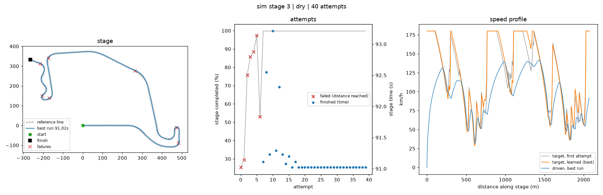

# aorbot — art of rally learning bot (concept)

**Goal:** a bot that learns to **finish one stage, with one car, in one weather**
in *art of rally*, and then keeps getting faster.

Because the stage, the car and the weather never change, every attempt is the
same problem again. The bot uses that: it drives the same line every time and
learns, stretch by stretch, how fast it can go without crashing. That takes
tens of attempts instead of the millions a from-scratch deep-RL agent needs.
That matters because the real game only runs in real time.

```
 you drive once          reference line        drive + learn, repeat
 ┌──────────────┐  build  ┌──────────────┐     ┌───────────────────────────────┐
 │ record your  │ ──────▶ │ line + grip  │ ──▶ │ line follower (steer, pedals) │
 │ run (telemetry)│        │ estimate     │     │   ▲ target speed per 20 m     │
 └──────────────┘         └──────────────┘     │   │                           │
                                               │ learner: crash → slower there │
                                               │          clean → a bit faster │
                                               │          remember crash speed │
                                               └───────────────────────────────┘
```

## How the learning works

1. **Demonstration.** You drive the stage once. The telemetry becomes the
   *reference line* (smoothed, resampled every 2 m). The same run also gives a
   *grip estimate*: how much sideways acceleration you used (`v² × curvature`),
   which is what this car can do in this weather.
2. **Driver.** A *pure-pursuit* steering controller aims at a point ahead on
   the line. Throttle and brake follow a target speed profile. Corner speed is
   `√(grip / curvature)`, and a backward braking pass starts slowing down early
   enough for each corner. While cornering hard, the throttle is limited so the
   tyres keep enough grip to turn (friction circle).
3. **Learner (iterative learning control).** The stage is split into 20 m
   *bins*, each with a speed scale that multiplies its corner speed. After
   every attempt:
   * leaving the stage / crashing / getting stuck → the bins in the 60 m before
     the failure get slower, and the scale that failed is stored as that bin's
     **limit**;
   * a near miss (large offset from the line) → a bit slower;
   * driven cleanly → 5 % faster, but never above 95 % of the bin's known limit.

   So each corner settles just under the speed where it went wrong, and the bot
   stops crashing in the same place again and again. The fastest finished
   attempt is saved as **best**, and `aorbot drive` uses it.
4. **Optional deep RL.** `aorbot/rl.py` wraps the same stage as a Gymnasium
   environment. A PPO policy adds *residual* corrections on top of the line
   follower. Train it in the simulator; on the real game it is slow (real time).
   In a quick simulator test (120k steps, about 1.5 min) it finished about
   1.5 % faster than the plain line follower. The speed-profile learner above
   gains about 12 % in 40 attempts, so it stays the main tool.

Results in the built-in simulator (`aorbot sim-demo`, 2 km stages, 40 attempts):

| start | first finish | crashes in last 10 attempts | best vs demo run |
|---|---|---|---|
| cautious (0.7 × demo corner speed) | attempt 0 | 0 | ~12 % faster |
| deliberately too fast (1.2–1.3 ×), dry / wet / snow | attempts 3–10 | 0 | ~9–12 % faster |



## Your setup (Windows, `D:\Games\artofrally`, BepInEx 5)

### 1. Python

```powershell
conda create -n aorbot python=3.11 -y
conda activate aorbot
cd <this repo>
pip install -e ".[gamepad,plot]"      # vgamepad asks to install the ViGEmBus driver: accept
aorbot sim-demo                        # quick offline check: writes runs\sim-demo\learning.png
```

### 2. Telemetry from the game

**Option A: the plugin in this repo** (`mod/AorBotTelemetry`, BepInEx 5). It
streams the car's position, orientation and velocity to UDP port 47800. It only
reads from the game.

```powershell
# needs the .NET SDK (https://dotnet.microsoft.com/download)
dotnet build -c Release mod\AorBotTelemetry -p:GameDir="D:\Games\artofrally"
# -> copies AorBotTelemetry.dll into D:\Games\artofrally\BepInEx\plugins\AorBotTelemetry\
```

Start the game. `BepInEx\LogOutput.log` should show `streaming car state to 127.0.0.1:47800`
and, once you are on a stage, `found car: ...`. See [mod/README.md](mod/README.md)
if it does not.

**Option B: [art-of-sim-rally](https://github.com/d-b-c-e/art-of-sim-rally)**
(UnityModManager). It has a SimHub telemetry option (Forza Horizon 5 format,
`127.0.0.1:8000`). Set `format = "forza"` and `port = 8000` in the config.

### 3. Config for your one stage/car/weather

```powershell
copy configs\art_of_rally.toml configs\my_stage.toml
```

Fill in `[conditions]` with the stage, car and weather you picked in-game. The
learned state is tied to them.

```powershell
aorbot check-telemetry --config configs\my_stage.toml
```

Drive a little. The x/y position should change and `race_on` should be 1.
With the forza format, `heading-vs-travel` should stay near 0 on straights.

### 4. Record your run and build the line

```powershell
aorbot record --config configs\my_stage.toml --out runs\demo_trace.npz
aorbot build-line runs\demo_trace.npz --out runs\line.npz
```

Drive the stage start to finish cleanly with your own controller, then stop
after the finish. Recording ends after 5 s standing still. A smooth, tidy run
matters more than a fast one.

### 5. Teach it how to restart the stage

The bot restarts between attempts with a button macro (pause → restart →
confirm) on its virtual Xbox pad. Menu layouts differ, so check it once while
you are on the stage:

```powershell
aorbot test-reset --config configs\my_stage.toml --line runs\line.npz
```

Adjust `[reset] macro` until the car ends up back at the start.

### 6. Learn, then drive

```powershell
aorbot learn --config configs\my_stage.toml --iterations 30 --save-traces runs\attempts
aorbot show                                   # summary of all attempts
aorbot drive --config configs\my_stage.toml   # one run with the best profile
```

Keep the game window focused and leave your physical controller alone. The
virtual pad is a second controller. `Ctrl+C` stops safely, and `learn` resumes
from `runs\learner.json`.

## Tuning

| symptom | change |
|---|---|
| car weaves left-right on straights | raise `[controller] max_steer_angle` or `lookahead_time` |
| runs wide in slow corners even when slow | lower `max_steer_angle` |
| small steering inputs do nothing | `[controls] steer_deadzone = 0.1` |
| fails where it was clearly still on the road | raise `[rules] max_offset` |
| brakes too late on wet / snow | lower `[speed] brake_decel` (≈4.5 wet, ≈3.5 snow) |
| too timid at the start | raise `[learn] init_scale` (0.7 = 70 % of your corner speeds) |
| reset gives up | fix `[reset] macro`, raise `countdown` / `timeout` |

## Without the game

* `aorbot sim-demo` runs the whole pipeline on a procedural stage in seconds.
* `aorbot fake-game` runs the simulator behind the game's UDP protocols, so
  `learn` / `drive` exercise the real-game code (telemetry receiver, controls,
  restart macro, real-time loop). See `configs/fake_game.toml`.
* `aorbot rl-train` trains the optional residual PPO policy (`pip install -e ".[rl]"`).

If you already have your own agent (e.g. in `D:\Games\artofrally\rl_agent`),
`aorbot.rl.RallyEnv(GameIO(...), line, cfg)` gives it a Gymnasium environment
over the same telemetry and virtual gamepad.

## Layout

```
aorbot/
  line.py        reference line: arc length, curvature, projection (progress + offset)
  speed.py       corner speeds, braking pass, grip estimate
  controller.py  pure pursuit + speed control (+ traction-aware throttle)
  episode.py     one attempt: finish / off-stage / stuck / flipped / timeout rules
  learner.py     per-bin speed learning with remembered limits, best profile
  record.py      record a human run, build the line
  game/          telemetry receiver (aorbot + Forza formats), vgamepad/keyboard, restart macro
  sim/           procedural stages, simple car model, fake game over UDP
  rl.py          optional Gymnasium environment + PPO
mod/AorBotTelemetry/  BepInEx 5 telemetry plugin (C#)
configs/       art_of_rally.toml (real game), fake_game.toml (offline)
tests/         pytest suite (sim learning, UDP loopback, telemetry, learner, RL env)
```

## Status / what is not verified yet

* Tested here: the learning loop, the simulator, both telemetry decoders, and
  the complete real-game code path against the fake game over UDP. The test
  suite covers these.
* The BepInEx plugin compiles against the official BepInEx 5.4.21 and
  Unity 2019.4 reference assemblies, but has **not been run inside art of
  rally**. It finds the car through the `CarDynamics` component (the name
  art-of-sim-rally uses). If that component is not found, it falls back to the
  heaviest Rigidbody in the scene.
* The default restart macro is a guess at the pause menu layout. Tune it with
  `test-reset`.
* The simulator is a simple stand-in for testing the pipeline, not art of
  rally's physics. Steering gains need a quick check on the real game.
